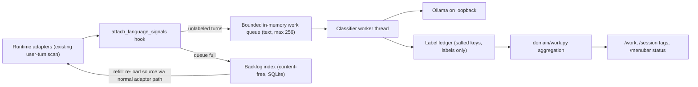

# Work Insights Design

Status: approved direction (2026-09-30), implementation in progress on
`feat/work-insights`. Classifier accuracy figures come from a local evaluation
and are recorded in the Evaluation section when final.

## Goal

Answer "what did the spend accomplish?" alongside "how much was spent?".
A local decision model labels each session's work so Token Meter can show
activity allocation, workstreams, rework, cost per kind of work, and model
right-sizing. Tokens are an input cost; these labels are the missing outcome
and quality evidence.

## Decisions

| Topic | Decision |
| --- | --- |
| Placement | New top-level **Work** page between Efficiency and Git. Order becomes `Sessions → Spend → Models → Subagents → Efficiency → Work → Git → Learn → Tools → Settings`. |
| Taxonomy | Two axes. A fixed **work type** (debug, feature, refactor, docs, explore, review, ops, other) owned by Token Meter, plus user-editable **areas** (2–8, name and one-line description) in Settings. Eight is the validated categorical palette limit. |
| Model | Jet v6.2 (Apache-2.0, Qwen3.5-4B decision model) served by the user's local Ollama. Model name and loopback URL are configurable. |
| Provisioning | Off by default. `scripts/setup-work-classifier` downloads Jet from Hugging Face with curl, verifies sizes, and runs `ollama create -q int4`. |
| Scope v1 | Classifier infrastructure, Work page, session tags, Settings controls, menu-bar pause, setup script. |
| Scope v2 | Session outcome joined with Git delivery, prompt-clarity coaching, live menu-bar nudge, MCP exposure, "spend rising while value is flat" alert. |

## Architecture

### Units

| Unit | Responsibility |
| --- | --- |
| `token_meter/services/work_insights.py` | Settings normalization, text cleaning and skeleton compression, label ledger, queue and backlog, pacing and throttle, Ollama client, worker lifecycle. No trace parsing. |
| `token_meter/domain/work.py` | Pure aggregation of cached session summaries plus ledger labels into allocation, workstreams, work-type economics, rework, and right-sizing. No I/O. |
| `token_meter/app.py` | Composition only: hook call, service singleton, watcher registration, HTTP routes, projections. |
| `page.html` | Work page, Settings → Work insights, session tag chips. |
| `menubar/TokenMeterMenuBar.swift` | Pause and resume item driven by the compact payload. |

### Hook and turn identity

`attach_language_signals(row, rollups, events)` already runs for every parsed
source with the adapter's human-turn list. The analysis step passes the turns
through a private field that the hook consumes and deletes before the row is
cached, so text never lives on a summary row.

- `session_key = sha256(salt ‖ row.id)[:24]`
- `turn_key = sha256(salt ‖ row.id ‖ ordinal ‖ sha256(text))[:32]`

Keys are salted with a per-machine random salt stored in the ledger, so they
are not reversible to sessions or text. Session-level questions (work type,
area, complexity) use the session's first human turn. Every later turn gets one
yes/no question: did the user say the previous work was wrong, broken, or not
what they asked for? The previous assistant message tail (600 characters,
cleaned) is included as context for that question.

Answer readout, chosen from the evaluation below:

- Choice questions (work type, area) are asked in the original and reversed
  option orders and the two distributions are averaged, cancelling position
  bias.
- Complexity uses the probability-weighted level rather than the top label.
- Confidence below 0.5 projects as Unclear (complexity excepted).

### Queue, backlog, and priority

- The work queue holds at most 256 cleaned, skeleton-compressed items
  (≤ 2,000 characters each). Duplicate keys are ignored.
- When the queue is full, only a content-free backlog row
  `(source_key, newest_ts, pending_count)` is written.
- At the low-water mark (64 items), the worker asks the application to
  invalidate the next backlog source's summary. The watcher re-loads it through
  the normal adapter path, which re-enqueues its unlabeled turns. No new adapter
  method is added and text never touches disk.
- Priority: sources active in the last 10 minutes first, then newest to oldest.
  Backfill horizon defaults to 90 days (options: 30, 90, 365, all).

### Text preparation

1. Strip runtime-injected wrappers: memory citations, file-citation directives,
   image tags, and "Files mentioned by the user … My request:" prefixes.
2. Skeleton compression for text over 2,000 characters: first 1,200 characters,
   headings and first lines of list items within budget, runs of log or code
   lines collapsed to `[N lines of pasted log/code]`, then the last 500
   characters.
3. The Jet prompt: fixed system prompt, `<state>` block, labeled options,
   one-token label readout, per-type temperature from Jet's `calibration.json`
   (`choice` 1.122, `score` 1.155, `noul` 1.542).

## Pacing, pause, and throttle

- One daemon worker, sequential requests, `num_ctx` 4,096, `keep_alive` 2 min so
  the model unloads when idle. Nothing in `/state`, `/session`, or `/menubar`
  waits on inference.
- Rate limit: token bucket, default 20 requests per minute, 250 ms minimum gap.
  Current-session items bypass the backlog queue but share the limit.
- Manual pause from Settings, the Work page header, or the menu bar:
  1 hour, until tomorrow (local 06:00), or until resumed. The worker checks
  before every request; the in-flight request (bounded by its timeout,
  typically under 2 s) completes, then a `keep_alive: 0` request unloads the
  model.
- Automatic throttle, re-evaluated before each request. Any hit sets state
  `throttled` with a reason and waits 60 s:
  - load average per CPU above 0.75 (skipped where unavailable);
  - on battery power when "Pause on battery" is on (default on; macOS reads
    `pmset -g batt` with a 2 s timeout; unknown means no signal);
  - median latency of the last 10 requests above 3× the rolling baseline.

## Failure handling and retries

| Failure | Classification | Behavior |
| --- | --- | --- |
| Connection refused, DNS, timeout | Transport | Circuit breaker: exponential backoff 5 s × 2ⁿ, cap 10 min, ±20% jitter. Probe `GET /api/version`. Items keep their attempt count. |
| HTTP 404 or "model not found" | Setup | State `setup_needed` with reason `model_missing`; probe `/api/tags` every 60 s. |
| HTTP 5xx, out of memory | Transport | Same backoff as transport. |
| HTTP 400, no usable label in logprobs | Item | Attempt +1; retry after 1 min, 10 min, 1 h; after 3 attempts record terminal `unclassifiable` with a reason code. Shown as Unclear. |
| Ledger I/O error | Storage | State `storage_error`; worker stops writing and retries every 5 min. Incompatible schema is moved aside and recreated, like the Git ledger. |
| Worker exception | Internal | Supervisor loop logs a sanitized reason code (no text, no exception message), sleeps with backoff, restarts. |
| Model digest changes | Version | New labels record the new digest; existing labels stay valid. Settings shows the version mix and offers "Relabel with current model". |
| Areas edited | Taxonomy | Area labels carry a taxonomy hash. Stale area labels count as Pending and are re-queued newest first. Work type and turn labels are unaffected. |

Request timeouts: connect 2 s; read 10 s plus 1 s per 1,000 prompt characters,
capped at 60 s. Labels are idempotent upserts keyed by `(turn_key, question)`.
Confidence below 0.5 is projected as **Unclear**, never as a category.

Worker states exposed to clients: `disabled`, `setup_needed`, `running`,
`idle`, `paused`, `throttled`, `backoff`, `storage_error`, each with a
bounded reason code, pending and labeled counts, and an ETA.

## Work page

Filters: period (last 3, 6, or 12 months, or all), runtime, project.
The header shows state, coverage ("Labeled 62% of turns in this period"),
pending count, ETA, and a Pause menu. Every module states that labels are
estimates from a local model.

1. **Monthly activity allocation.** A 100% stacked bar per month by area with a
   measure selector (user turns, sessions, spend). Pending and Unclear are
   explicit segments. Month totals on the right; partial months are marked.
2. **Workstreams.** For a selected month: project × area rows with turns,
   share, sessions, spend, rework rate, and dominant work type.
3. **Work type economics.** Per work type: sessions, spend, cost per session,
   median turns, rework rate.
4. **Rework.** Correction rate by week and by runtime-scoped model. Rates with
   fewer than 20 turns show "few samples".
5. **Right-sizing.** A complexity (routine, everyday, complex, high-impact) ×
   model price tier (light, standard, premium) grid. Tiers are terciles of the
   user's observed runtime-scoped models by catalog output price. Each cell
   shows spend, sessions, and rework. Premium-on-routine spend is labeled
   "possible overspend (estimate)". Light-on-complex with rework above the
   user's median is labeled "possible false economy".

Sessions → selected session shows tag chips: area, work type, complexity, and
correction count.

Settings → Work insights: enable toggle with the privacy explanation, status
and setup command, pause controls, pause on battery, rate, backfill horizon,
areas editor (2–8 areas, name ≤ 40 characters, description ≤ 160 characters,
reset to defaults), and "Delete all labels" with confirmation.

## Privacy

- User-turn text exists only in process memory, only for unlabeled turns, only
  while queued, and is sent only to the configured loopback Ollama URL.
- The Ollama URL must be `http` with host `127.0.0.1`, `localhost`, or `::1`.
  Redirects are refused.
- The ledger stores salted keys, enum labels, confidences, model digest,
  taxonomy hash, timestamps, and reason codes. Area names are user settings.
- Logs and API errors use reason codes only.
- `/work` and session tags are allowlisted aggregates and enums. No text,
  paths, or keys are projected. Project labels follow existing projections.
- Disabling the feature stops the worker and clears the queue. "Delete all
  labels" removes the ledger file and rotates the salt.

## Testing

- Service unit tests with an in-process fake Ollama: success, logprob parsing
  for each question type, model missing, connection refused with backoff and
  circuit probe, malformed response retry to terminal, pause and resume,
  throttle signals with injected clock and load, rate limit, queue bound and
  backlog refill, taxonomy change re-queue, model digest change.
- Privacy tests: the ledger file contains no sample text; `/work` and session
  payloads contain no text; non-loopback URLs are rejected.
- Settings validation: bounds, idempotent writes, migration from absent keys.
- Domain tests: allocation by each measure, Unclear and Pending handling,
  workstreams, rework minimum samples, right-sizing tiers.
- UI: embedded JS parse, route and order contracts, browser checks at wide
  desktop and 1,024 px.
- Native: Swift compile, smoke output, live menu-bar pause check.
- Installed runtime: install, `/health`, `/menubar`, manifest parity.

## Evaluation

Local evaluation, 2026-09-30, Jet v6.2 int4 in Ollama 0.34.4 on Apple
Silicon. Inputs: 1,836 unique human turns (1,390 follow-ups, 444 session
openers) from local Claude and Codex traces; subagent sessions and injected
messages excluded. Ground truth: 180 turns (90 random follow-ups, 30 likely
corrections, 60 openers) labeled blind by the implementing agent from
redacted, truncated text; genuinely ambiguous turns accept either reading.

| Signal | Result |
| --- | --- |
| Work type (8 classes, order-averaged) | 83% (50/60); 89% when confidence ≥ 0.6 |
| Correction yes/no with context | precision 0.81, recall 0.79, F1 0.80 |
| Correction yes/no without context | F1 0.78 |
| Complexity, probability-weighted | 62% exact; 97% within one level |
| Reversed option order changed the answer | 24% of choice answers |
| Skeleton vs full text on 49 long prompts | same correction label 49/49, same work type 22/24, ~37% fewer tokens |
| Median latency on real turns | ~0.7 s under 500 characters; 1.4 s on long prompts |

Rejected alternatives: a five-way turn-type question (78% accuracy, position
bias, and not needed for any projected metric); an expanded "pushing back"
correction wording (precision fell to 0.67); OR-combining correction
detectors (precision 0.67). A lexical baseline agreed with Jet on only 28 of
233 detected corrections and missed 179, so rework cannot come from phrase
matching alone.

These figures come from one user's sessions and one labeler; treat them as a
smoke-level baseline, not a benchmark.
